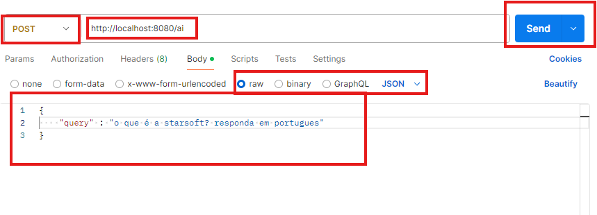
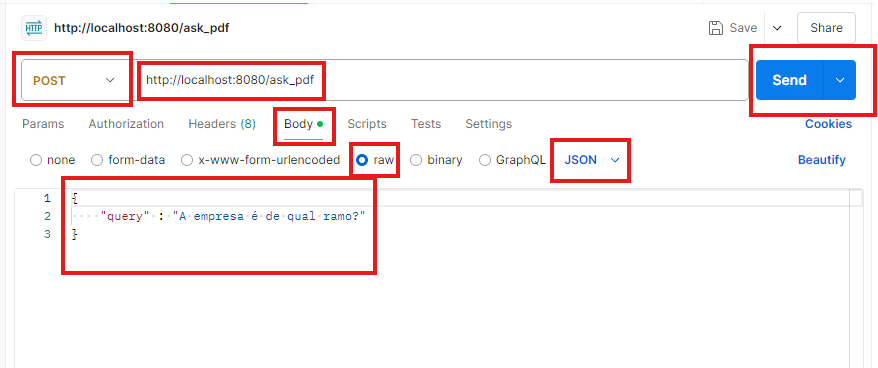
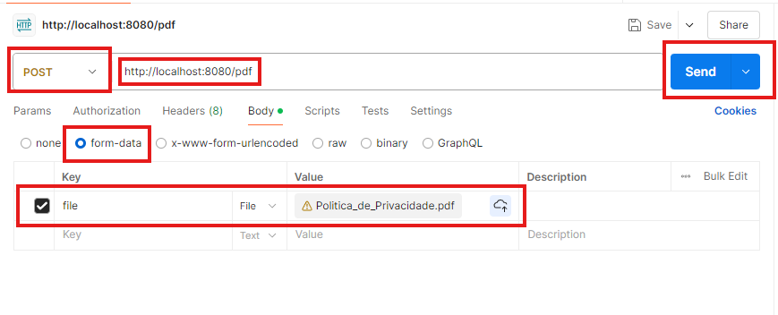

##  StarSoft - AI Development Test

Este repositório contém uma aplicação construída como parte de um teste técnico para a empresa **Starsoft**. O projeto tem como objetivo demonstrar o uso de **LangChain**, **ChromaDB**, **Ollama**, **Docker Compose** e, como um adiconal, utilização de **Flask API** em um sistema de Recuperação Aumentada de Conhecimento (RAG).

## Referências Bibliográficas

Durante o desenvolvimento deste projeto, as seguintes fontes foram cruciais para a compreensão e solução dos problemas encontrados:

1. **[YouTube: Ollama Docker - AI Development](https://www.youtube.com/watch?v=7VAs22LC7WE&t=1076s)**  
   Este vídeo ofereceu uma visão detalhada sobre como configurar e utilizar o Ollama no Docker, abordando os desafios e soluções para integrar LangChain e outros componentes em um ambiente Docker.

2. **[Medium: Ollama - Build a Chatbot with LangChain & Ollama (Deploy on Docker)](https://abvijaykumar.medium.com/ollama-build-a-chatbot-with-langchain-ollama-deploy-on-docker-5dfcfd140363)**  
   Este artigo ajudou a entender a construção de chatbots usando LangChain e Ollama, além de fornecer insights sobre a implementação no Docker.

3. **[Medium: Build RAG Application Using a LLM Running on Local Computer with Ollama and LangChain](https://medium.com/rahasak/build-rag-application-using-a-llm-running-on-local-computer-with-ollama-and-langchain-e6513853fda0)**  
   Um guia abrangente sobre como construir uma aplicação RAG (Recuperação Aumentada de Conhecimento) usando Ollama e LangChain, que foi fundamental para este projeto.

4. **[Medium: Open Source Self-Hosted RAG LLM Server with ChromaDB, Docker & Ollama](https://medium.com/@mbrazel/open-source-self-hosted-rag-llm-server-with-chromadb-docker-ollama-7e6c6913da7a)**  
   Este artigo detalha como configurar um servidor RAG auto-hospedado usando ChromaDB, Docker e Ollama, oferecendo uma base sólida para a dockerização do projeto.

## Desafios e Conhecimentos Adquiridos

### Desafios

O maior desafio durante o desenvolvimento deste projeto foi a **dockerização** de todos os componentes, especialmente ao tentar rodar o modelo **llama3** no Docker. A escassez de tutoriais específicos para esse cenário, especialmente em português, tornou o processo mais complexo. A necessidade de gerenciar recursos como memória e compatibilidade entre contêineres exigiu um entendimento aprofundado das ferramentas utilizadas e ajustes finos para garantir que tudo funcionasse corretamente.

### Conhecimentos Adquiridos

Durante o projeto, foram adquiridos diversos conhecimentos práticos, incluindo:

- **Integração de LLMs com LangChain**: Compreender como conectar modelos de linguagem de larga escala (LLMs) com o LangChain para construir uma aplicação RAG eficiente.
- **Configuração do Ollama no Docker**: A experiência de configurar e rodar o Ollama dentro de um contêiner Docker foi um aprendizado significativo, incluindo a solução de problemas relacionados à alocação de memória e dependências.
- **Uso de ChromaDB para Indexação de Dados**: Aprender a utilizar o ChromaDB para indexar e recuperar informações de forma eficaz em um sistema RAG.
- **Otimização e Gerenciamento de Recursos no Docker**: Adquirir habilidades para otimizar o uso de recursos, como memória, dentro de contêineres Docker, garantindo que o ambiente de desenvolvimento fosse estável e eficiente.

## **Descrição do Projeto**

O sistema consiste em uma aplicação web que oferece dois principais endpoints:

1. **/ai**: Endpoint para realizar consultas diretas ao modelo de linguagem integrado, utilizando **Ollama**.
2. **/ask_pdf**: Endpoint que permite realizar consultas baseadas em arquivos PDF previamente enviados e processados, utilizando **LangChain** para construção de cadeias de recuperação e **ChromaDB** como banco de dados vetorial para armazenar os embeddings gerados.

Além disso, um endpoint adicional (**/pdf**) permite o upload de arquivos PDF, que são automaticamente processados e armazenados no banco de dados vetorial.

### **Principais Tecnologias Utilizadas**

- **LangChain**: Utilizado para criar cadeias de recuperação de documentos, permitindo consultas eficientes com base em textos processados e indexados a partir de PDFs.
- **ChromaDB**: Banco de dados vetorial utilizado para armazenar os embeddings gerados a partir dos documentos PDF.
- **Ollama**: Integrado como modelo de linguagem principal para consultas diretas e para geração de respostas nas cadeias de recuperação.
- **Flask API**: Utilizado para criar a API da aplicação que gerencia as requisições HTTP, oferecendo endpoints para interação com o modelo de linguagem e processamento de PDFs. A API pode ser facilmente testada utilizando ferramentas como o **Postman** para enviar requisições POST e verificar as respostas.
- **Docker Compose**: Utilizado para orquestrar o ambiente de contêineres da aplicação, incluindo o contêiner Flask para a API e o contêiner ChromaDB para o armazenamento vetorial persistente.

## **Como Executar o Projeto**

### **Pré-requisitos**

- Docker e Docker Compose instalados na sua máquina.
- Postman para realizar requisições HTTP e testar os endpoints. Você pode baixá-lo através do [link oficial](https://www.postman.com/downloads/).

### **Passos para Execução**

1. Clone o repositório:

   Relizar Clone do Repositório através do acesso ao link do GitHub

2. Inicie o contêiner do app utilizando o Docker Compose:

    Execute os comandos na seguinte sequenCia:
    2.1. **docker compose build** 
    2.2. **docker compose up**
    2.3. **docker exec -it <nome_conteainer> /bin/bash**

3. Dentro do contêiner, execute o seguinte comando para iniciar a aplicação:

    ollama pull llama3 (para poder rodar o llama3)

### **Testando os Endpoints com Postman**

Utilize o **Postman** para testar os endpoints da aplicação. Abaixo estão as instruções para realizar requisições HTTP POST para cada um dos endpoints disponíveis:

- **/ai [POST]**: Realize uma consulta direta ao modelo de linguagem.
  - **Requisição**: Envie um JSON no corpo da requisição com o campo `query`.
  - **Exemplo de Corpo da Requisição**:
    

- **/ask_pdf [POST]**: Realize uma consulta nos documentos carregados no banco de dados vetorial.
  - **Requisição**: Envie um JSON no corpo da requisição com o campo `query`.
  - **Exemplo de Corpo da Requisição**:
    

- **/pdf [POST]**: Faça o upload de um arquivo PDF para o sistema.
  - **Requisição**: Envie o arquivo PDF utilizando o campo `file` do formulário (no Postman, utilize a opção `form-data`).
  - **Exemplo**:
    

Após enviar as requisições, você poderá visualizar as respostas retornadas pela API diretamente no Postman.   
